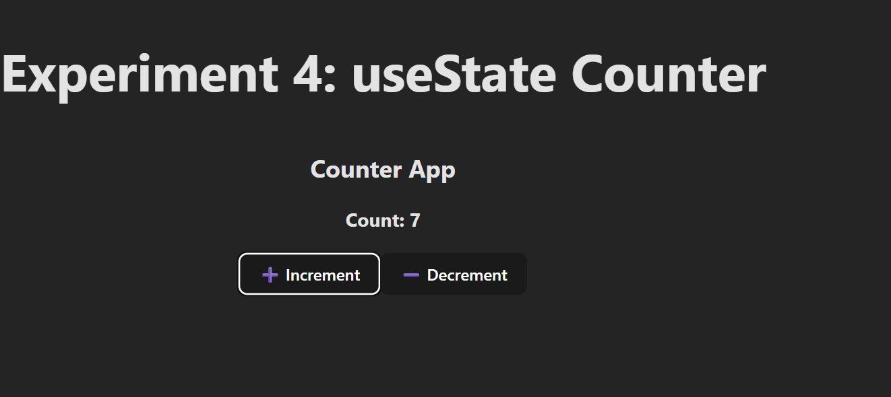

# 📘 Experiment 4: Counter App using useState Hook (CO2, CO3)

## Steps to Run
## Screenshots

Here’s a preview of the app:



### 1. Create a new React project
```bash
npm create vite@latest react-counter-app
cd react-counter-app
npm install
npm install @vitejs/plugin-react --save-dev
npm run dev
